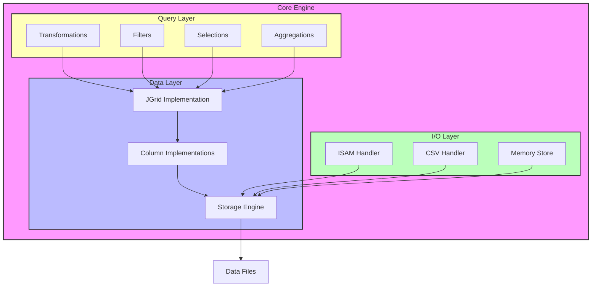
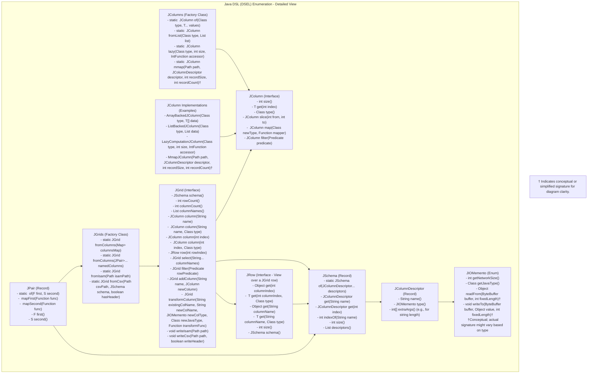

Okay, this is a fascinating and ambitious request! You're aiming for a paradigm shift from your existing Kotlin `columnar` library to a Java-centric one, leveraging Java `records` for immutability and JIT optimization, all while building a sophisticated, lazy, mmap-based columnar DSL. The goal is to guide "weary Pandas users" through high-performance data manipulation for a 2D grid, supporting extensive use of enums and functional patterns (`Pai2`-like structures, lambdas in vtables).

Here's a comprehensive `README.md` outlining a roadmap, addressing your POM structure, and detailing the proposed Java types and DSL, directly comparing with your Kotlin concepts.

```markdown
# Moneyfan: High-Performance Columnar DSL for Java

## 1. Vision & Goals

*   Provide a Java-native, high-performance, lazy, memory-mapped (mmap'd) columnar expression Domain Specific Language (DSL) for 2D grid data.
*   Offer an intuitive yet powerful alternative for users familiar with Pandas, focusing on performance, type safety, and immutability.
*   Leverage Java `records` and `enums` as primary data-holding constructs to benefit from JIT optimizations (aligning with Project Valhalla's direction for value types).
*   Champion a functional, expression-based DSL: operations build computation graphs, not immediate results.
*   Support efficient I/O through an ISAM-like (Indexed Sequential Access Method) columnar storage mechanism, described by `JIOMemento` type definitions.
*   Serve as the core data processing engine for the `acapulco` (Binance data ingest/processing) and `control` (simulation) modules.

## 2. Core Design: "Go-like Typealias -> Java Record Composition"

The philosophy is to have minimal "code" in the traditional sense for data representation. Data structures are defined as `records` (immutable, concise) and `enums` (fixed value sets), with static factory methods providing fluent instantiation – similar to how Kotlin's `value class` records or Go's simple structs with factories might be used.

*   **Data-Centric:** Pure data representation is key.
*   **Immutability by Default:** Java `records` are inherently immutable.
*   **Static Factories & Fluent Builders:** The DSL relies on static factory methods for construction (e.g., `JColumn.of(...)`, `JGrid.fromCsv(...)`).
*   **Expressive & Type-Safe:** The DSL aims to provide "syntactic sugar" that is type-safe and guides users through complex operations.
*   **Self-Similar Expressions:** Operations on DSL elements (like `JGrid` or `JColumn`) return new instances of those elements, representing a new state of the lazy expression, enabling chaining and excellent IntelliJ autocompletion.

## 3. Proposed Type System & DSL Primitives (Kotlin vs. Java)

This section translates your core Kotlin concepts to their Java `record`-based equivalents and outlines the DSEL enrichment.

### 3.1. Fundamental Pair: `Pai2<F,S>` -> `JPair<F,S>` (Record)

*   **Kotlin (conceptual from your usage):**
    ```kotlin
    // Likely an interface or typealias representing an immutable pair
    // typealias Pai2<F, S> = some.kotlin.Pair<F, S>
    // infix fun <F, S> F.t2(s: S): Pai2<F, S> = ...
    ```
*   **Java (Proposed):**
    ```java
    // package com.moneyfan.dsl.core;
    public record JPair<F, S>(F first, S second) {
        // Static factory for DSL feel
        public static <F, S> JPair<F, S> of(F first, S second) {
            return new JPair<>(first, second);
        }

        // Example DSL enrichment:
        public <R> JPair<R, S> mapFirst(java.util.function.Function<F, R> func) {
            return new JPair<>(func.apply(first), second);
        }
        public <R> JPair<F, R> mapSecond(java.util.function.Function<S, R> func) {
            return new JPair<>(first, func.apply(second));
        }
    }
    ```
*   **DSL Enrichment in Java:**
    *   **Construction:** `JPair.of(value1, value2)` or directly `new JPair<>(value1, value2)`.
    *   **Usage:** For users, `JPair` instances become fundamental building blocks. The DSEL would compose these, for example, when representing a row with a (value, metadata) structure for each cell.

### 3.2. IO Type Descriptors: `IOMemento` (Enum) -> `JIOMemento` (Enum)

*   **Kotlin (conceptual):**
    ```kotlin
    // enum class IOMemento(override val networkSize: Int? = null) : TypeMemento { ... }
    ```
*   **Java (Proposed):**
    ```java
    // package com.moneyfan.dsl.io;
    public enum JIOMemento {
        BOOLEAN(1, java.lang.Boolean.TYPE), BYTE(1, java.lang.Byte.TYPE),
        INT(4, java.lang.Integer.TYPE), LONG(8, java.lang.Long.TYPE),
        FLOAT(4, java.lang.Float.TYPE), DOUBLE(8, java.lang.Double.TYPE),
        LOCAL_DATE(8, java.time.LocalDate.class), // Stored as epochDay (long)
        INSTANT(12, java.time.Instant.class),   // Stored as epochSecond (long) + nano (int)
        STRING_FIXED(-1, String.class), // Network size determined by accompanying length
        STRING_VAR(-1, String.class),   // Variable length (e.g., null-terminated or length-prefixed)
        NOTHING(0, Void.TYPE);          // Placeholder

        private final int networkSize; // Bytes; -1 for variable/defined elsewhere
        private final Class<?> javaType;

        JIOMemento(int networkSize, Class<?> javaType) {
            this.networkSize = networkSize;
            this.javaType = javaType;
        }

        public int getNetworkSize() { return networkSize; }
        public Class<?> getJavaType() { return javaType; }
        
        // Potentially add methods for reading/writing from/to ByteBuffer for ISAM
        public Object readFrom(java.nio.ByteBuffer buffer, int fixedLength) { /* ... */ return null;}
        public void writeTo(java.nio.ByteBuffer buffer, Object value, int fixedLength) { /* ... */ }
    }
    ```
*   **DSL Enrichment in Java:**
    *   `JIOMemento` instances are used to define the schema of columnar data, especially for I/O operations (CSV parsing, ISAM serialization).
    *   Example: `JSchema.of(JPair.of("price", JIOMemento.DOUBLE), JPair.of("name", JIOMemento.STRING_FIXED, 32))`
    *   This makes schema definition explicit and type-aware for storage and retrieval.

### 3.3. Columns/Vectors: `Vect0r<T>` (Kotlin Value Class) -> `JColumn<T>` (Java Interface/Record)

*   **Kotlin (conceptual):**
    ```kotlin
    // @JvmInline value class Vect0r<T>(internal val delegate: Pai2<Int, (Int) -> T>)
    // Static factories in `_v` object
    ```
*   **Java (Proposed):**
    An interface defining columnar behavior, with various backing implementations (array, lazy computation, mmap).
    ```java
    // package com.moneyfan.dsl.column;
    public interface JColumn<T> {
        int size();
        T get(int index);
        Class<T> type(); // For runtime type info

        // DSL Operations returning new JColumn expressions (lazy)
        JColumn<T> slice(int from, int to);
        <R> JColumn<R> map(Class<R> newType, java.util.function.Function<T, R> mapper);
        JColumn<T> filter(java.util.function.Predicate<T> predicate); // Returns indices or a masked column
        // ... zip, sort, aggregations (sum, mean etc. which would materialize a value)
    }

    // Factory methods, possibly in a 'JColumns' utility class
    public class JColumns {
        public static <T> JColumn<T> of(Class<T> type, T... values) { /* new ArrayBackedColumn<>(type, values); */ return null; }
        public static <T> JColumn<T> fromList(Class<T> type, java.util.List<T> list) { /* ... */ return null; }
        public static <T> JColumn<T> lazy(Class<T> type, int size, java.util.function.IntFunction<T> accessor) {
            // return new LazyComputationColumn<>(type, size, accessor); 
            return null;
        }
    }
    ```
*   **DSL Enrichment in Java:**
    *   **Construction:** `JColumn<Integer> ids = JColumns.of(Integer.class, 1, 2, 3);`
    *   **Operations:** `JColumn<String> names = JColumns.lazy(String.class, 100, i -> "User" + i);`
    *   `JColumn<Integer> doubledIds = ids.map(Integer.class, id -> id * 2);`
    *   Chaining creates a sequence of lazy operations. Data is only read/computed when `get(index)` is called or a materializing operation (like `toList()`, `sum()`) is invoked.

### 3.4. 2D Grid/DataFrame: `Cursor` (Kotlin Typealias) -> `JGrid` (Java Interface/Record)

*   **Kotlin (conceptual):**
    ```kotlin
    // typealias RowVec = Vect0r<Pai2<Any?, CellMeta>> // CellMeta holds type & name
    // typealias Cursor = Vect0r<RowVec>
    ```
*   **Java (Proposed):**
    `JGrid` manages a collection of named `JColumn`s. `JRow` provides a view into a single row.
    ```java
    // package com.moneyfan.dsl.grid;
    public record JColumnDescriptor(String name, JIOMemento type, int... extraArgs /* e.g., fixed string length */) {}

    public record JSchema(java.util.List<JColumnDescriptor> descriptors) {
         public static JSchema of(JColumnDescriptor... descriptors) {
            return new JSchema(java.util.List.of(descriptors));
        }
        public int indexOf(String name) { /* ... */ return -1; }
        public JColumnDescriptor get(String name) { /* ... */ return null;}
        public JColumnDescriptor get(int index) { /* ... */ return null;}
        public int size() { return descriptors.size(); }
    }

    public interface JRow {
        Object get(int columnIndex);
        <T> T get(int columnIndex, Class<T> type);
        Object get(String columnName);
        <T> T get(String columnName, Class<T> type);
        int size();
        JSchema schema();
    }

    public interface JGrid {
        JSchema schema();
        int rowCount();
        int columnCount();
        java.util.List<String> columnNames();

        JColumn<?> column(String name);
        <T> JColumn<T> column(String name, Class<T> type);
        JColumn<?> column(int index);
        <T> JColumn<T> column(int index, Class<T> type);
        
        JRow row(int rowIndex); // Returns a row view

        // DSL Operations (Lazy, returning new JGrid expressions)
        JGrid select(String... columnNames);
        JGrid filter(java.util.function.Predicate<JRow> rowPredicate);
        JGrid addColumn(String name, JColumn<?> newColumn); // Column must match rowCount
        <O, R> JGrid transformColumn(String existingColName, String newColName, JIOMemento newColType, Class<R> newJavaType, java.util.function.Function<O, R> transformFunc);
        // ... operations like groupBy, pivot, join, sort
        
        // IO Operations
        void writeIsam(Path path);
        void writeCsv(Path path); // Example
    }

    // Factory class for JGrid
    public class JGrids {
        // From a map of column names to JColumn objects
        public static JGrid fromColumns(java.util.Map<String, JColumn<?>> columns) { /* ... */ return null;}
        // Simplified varargs version
        public static JGrid fromColumns(JPair<String, JColumn<?>>... namedColumns) {
            java.util.Map<String, JColumn<?>> map = new java.util.LinkedHashMap<>();
            for(JPair<String, JColumn<?>> pair : namedColumns) { map.put(pair.first(), pair.second()); }
            return fromColumns(map);
        }

        public static JGrid fromIsam(Path isamPath) { /* Implementation to read ISAM file and metadata */ return null; }
        public static JGrid fromCsv(Path csvPath, JSchema schema, boolean hasHeader) { /* Implementation to read CSV */ return null; }
    }
    ```
*   **DSL Enrichment in Java:**
    *   **Construction:**
        ```java
        JColumn<Integer> ids = JColumns.of(Integer.class, 1, 2);
        JColumn<String> names = JColumns.of(String.class, "A", "B");
        JGrid grid = JGrids.fromColumns(
            JPair.of("ID", ids),
            JPair.of("Name", names)
        );
        ```
    *   **Pandas-like Operations (Lazy):**
        ```java
        JGrid filteredGrid = grid.filter(row -> (Integer)row.get("ID") > 1);
        JGrid selectedCols = filteredGrid.select("Name");
        JGrid derivedColGrid = selectedCols.transformColumn("Name", "NameLength", JIOMemento.INT, Integer.class, (String name) -> name.length());
        ```
    *   Each operation creates a new `JGrid` view or a `JGrid` with derived columns without immediately processing data. This chain forms the lazy expression.

### 3.7. Lambdas in "VTables" (Derived Columns)

*   This translates to columns whose values are not stored directly but computed via a lambda function.
*   The `JColumns.lazy(type, size, accessor)` factory creates such columns.
*   The `JGrid.transformColumn()` or `JGrid.addColumn()` (when given a lazy `JColumn`) implements this.
    ```java
    JGrid grid = ... ; // existing grid with "price" and "quantity"
    JColumn<Double> totalPriceCol = JColumns.lazy(Double.class, grid.rowCount(), 
        i -> {
            JRow row = grid.row(i);
            Double price = row.get("price", Double.class);
            Integer quantity = row.get("quantity", Integer.class);
            return (price != null && quantity != null) ? price * quantity : null;
        }
    );
    JGrid gridWithTotal = grid.addColumn("total_price", totalPriceCol);
    ```

## 4. ISAM Design and IO Integration (Java Focus)

The existing `ISAMCursor.kt` logic provides a good base. For Java:

*   **`ISAMWriter` / `JGrid.writeIsam(Path)`:**
    1.  Iterate through the `JGrid`'s `JSchema` to determine column names, `JIOMemento` types, and calculate fixed field offsets for the `.meta` file and binary records. Variable-length strings will require careful handling (e.g., fixed max size with padding, or a separate index).
    2.  Write the `.meta` file.
    3.  Open a `FileChannel` for the binary data file.
    4.  Use a `ByteBuffer` (potentially direct for performance) to construct each record.
    5.  For each row in the `JGrid`:
        *   For each column: get the value, serialize it to the `ByteBuffer` according to its `JIOMemento` (and pre-calculated offset/length).
        *   Write the `ByteBuffer` to the `FileChannel`.
*   **`ISAMReader` / `JGrids.fromIsam(Path)`:**
    1.  Read the `.meta` file to populate a `JSchema`.
    2.  For each column in the schema:
        *   Create a `MmapJColumn<T>` (an implementation of `JColumn<T>`).
        *   The `MmapJColumn` constructor will take the binary file path, `JIOMemento` for the column type, its offset within a record, and the item size (or method to determine it for variable types). It will internally `mmap` the relevant segment of the file (or the whole file if manageable).
        *   Its `get(int rowIndex)` method will:
            *   Calculate the absolute position in the mmap'd `ByteBuffer` (`rowIndex * recordLength + columnOffset`).
            *   Read the appropriate number of bytes.
            *   Deserialize these bytes into the Java type `T` based on `JIOMemento`.
    3.  Construct and return a `JGrid` using these `MmapJColumn` instances.
*   **Lazy Mmap Access:** The OS handles demand-paging for `MappedByteBuffer`. Access to `MmapJColumn.get(index)` will trigger page faults and load data from disk only when that specific piece of data is needed.

## 5. Addressing the Maven Structure and Build (Based on User's Log)

The Maven output indicates a multi-module project. The existing structure (`mp-superproject` as parent, with modules like `columnar`, `binance`, `mp` (itself a parent to `acapulco`, `control`), `bfneat`) can be streamlined for a Java-centric refactor under a new root "moneyfan" parent.

**Project Structure Confirmation:**
The project will maintain a single-module (mono-pom) Maven structure with all functionality contained within the `moneyfan` artifact. This simplifies development and deployment while meeting current requirements.
**Proposed Cleaned POM Structure:**

*   **`moneyfan/pom.xml` (Root Parent):**
    *   `<groupId>com.moneyfan</groupId>` (or user's choice)
    *   `<artifactId>moneyfan-parent</artifactId>`
    *   `<packaging>pom</packaging>`
    *   `<modules>`:
        *   `columnar-dsl` (The new Java DSL core)
        *   `binance-client-java` (User's existing, potentially unmodified, assuming it's Java)
        *   `acapulco-ingest` (Refactored to use `columnar-dsl`)
        *   `control-simulator` (Refactored to use `columnar-dsl`)
        *   `bfneat` (If kept and using `columnar-dsl`)
    *   `<properties>`: Define `java.version` (e.g., 17 or 21), common dependency versions.
    *   `<dependencyManagement>`: Manage versions for shared dependencies (`junit`, `slf4j`, etc.).
    *   `<build><pluginManagement>`: Configure common plugins (`maven-compiler-plugin`, `maven-surefire-plugin`).

*   **`moneyfan/columnar-dsl/pom.xml`:**
    *   Parent: `moneyfan-parent`.
    *   ArtifactId: `columnar-dsl`.
    *   Dependencies: `slf4j-api`, testing libraries (`junit-jupiter`). NO Kotlin dependencies.

*   **`moneyfan/acapulco-ingest/pom.xml`:**
    *   Parent: `moneyfan-parent`.
    *   ArtifactId: `acapulco-ingest`.
    *   Dependencies: `com.moneyfan:columnar-dsl`, `com.binance.api:binance-api-client`, CSV library if needed.

*   **`moneyfan/control-simulator/pom.xml`:**
    *   Parent: `moneyfan-parent`.
    *   ArtifactId: `control-simulator`.
    *   Dependencies: `com.moneyfan:columnar-dsl`, `com.moneyfan:acapulco-ingest` (if direct interaction is needed).

**Fixing the Build Error in `control`:**
The error `Failed to collect dependencies for project pkg.random:control:jar:1.5.0-SNAPSHOT / Failed to read artifact descriptor for pkg.random:acapulco:jar:1.5.0-SNAPSHOT` is typical when a dependency (`acapulco`) is not correctly built and installed before the dependent module (`control`) tries to resolve it.
The proposed structure above, where `acapulco-ingest` and `control-simulator` are sibling modules under `moneyfan-parent` and built in the same reactor invokation, resolves this naturally. `control-simulator` would depend on `acapulco-ingest` via:
```xml
<dependency>
    <groupId>${project.groupId}</groupId> <!-- Inherits from moneyfan-parent -->
    <artifactId>acapulco-ingest</artifactId>
    <version>${project.version}</version> <!-- Inherits from moneyfan-parent -->
</dependency>
```

## 6. Project "Moneyfan" Omnibus Roadmap

### Phase 1: Core Java DSL (`columnar-dsl` module) - Foundation

1.  **Define Core Types:** Implement `JPair`, `JIOMemento`, `JColumnDescriptor`, `JSchema` as Java records/enums.
2.  **`JColumn<T>` Interface:** Define the interface with basic operations (`size`, `get`, `map`, `filter`, `slice`).
3.  **`JColumn` Implementations (In-Memory):**
    *   `ArrayBackedJColumn<T>`: Simple implementation wrapping a `T[]`.
    *   `ListBackedJColumn<T>`: Wraps a `java.util.List<T>`.
    *   `LazyComputationJColumn<T>`: Takes size and an `IntFunction<T>` for on-demand value generation.
4.  **`JGrid` & `JRow` Interfaces:** Define their APIs (`rowCount`, `column`, `row`, `get`, `select`).
5.  **`JGrid` Implementation (In-Memory):** Backed by `Map<String, JColumn<?>>`.
6.  **Factory Classes:** `JColumns`, `JGrids` with initial static factory methods for construction from arrays, lists, and lazy accessors.
7.  **Unit Tests:** Thoroughly test all core types and basic operations.

### Phase 2: ISAM I/O (`columnar-dsl` module) - Persistence

1.  **Meta File Utilities:** Java classes to parse and generate the `.meta` file (column names, `JIOMemento` types, offsets, record length).
2.  **`MmapJColumn<T>` Implementation:**
    *   Uses `java.nio.MappedByteBuffer` for a specific column in an ISAM file.
    *   Implements `JColumn.get(int)` by calculating file offsets and deserializing based on `JIOMemento`.
    *   Handles fixed-size types initially.
3.  **`JGrids.fromIsam(Path)`:** Factory to read `.meta` and construct a `JGrid` composed of `MmapJColumn`s.
4.  **`JGrid.writeIsam(Path)`:**
    *   Writes `.meta` based on the `JGrid`'s schema.
    *   Serializes data to a binary ISAM file, row by row or column by column, using `FileChannel` and `ByteBuffer`.
5.  **CSV Utilities (Optional but useful for `acapulco`):**
    *   `JGrids.fromCsv(Path, JSchema, boolean hasHeader)` to load CSV into a `JGrid` (initially could be memory-backed columns).
    *   `JGrid.writeCsv(Path)` for basic CSV output.
6.  **Unit Tests:** Test ISAM read/write for all supported `JIOMemento` types, including edge cases and mmap behavior.

### Phase 3: `acapulco-ingest` Module Refactor & Integration

1.  **Create `acapulco-ingest` Module:** Set up as a Java module depending on `columnar-dsl` and `binance-client-java`.
2.  **Data Ingest Logic (Java):**
    *   Re-implement fetching logic (your `fetchklines.sh` and `dayklines.sh` calls) if needed, or ensure shell script outputs are parsable by Java CSV/ISAM readers.
    *   Port `HistoryService.fixOpaqueCsv` to Java to parse CSV files from Binance into `JGrid` objects.
    *   Re-implement data transformations (like `DataBinanceVision.klines.fixup`, `UnixTimeRemapper`) using the `JGrid` DSL (e.g., `transformColumn`, `select`, `filter`).
3.  **`AssetModel` Adaptation:** Modify `AssetModel` to store and manage `JGrid` instances. The `push` mechanism will add `JGrid`s created from ISAM or CSV.
4.  **Output to ISAM:** Use `JGrid.writeIsam()` to persist processed Binance kline data.
5.  **Testing:** Validate data integrity through the ingest pipeline, comparing against original Kotlin output where possible.

### Phase 4: `control-simulator` Module Refactor & Integration

1.  **Create `control-simulator` Module:** Set up as a Java module depending on `columnar-dsl` (and `acapulco-ingest` if it provides data directly, or just consume ISAM files written by `acapulco`).
2.  **Adapt `Harnass` and `Simulation`:**
    *   Modify these classes to use `JGrid` and `JRow` for accessing historical/market data from `AssetModel` or ISAM files.
    *   Replace Kotlin `Cursor` manipulations with the Java `JGrid` DSL operations.
3.  **SimWallet/TradeFSM:** If these interact directly with the columnar data, update them to use the `JGrid` API.
4.  **Testing:** Ensure simulation logic works correctly with the new Java data structures and DSL.

### Phase 5: Advanced DSL Features and Performance Tuning

1.  **Expand DSL:** Implement more complex `JGrid` operations:
    *   `groupBy(columnNames...).aggregate(...)`
    *   `pivot(...)` (This is complex; start with common use cases)
    *   `join(otherGrid, onColumns..., joinType)`
    *   `sortBy(columnNames...)`
2.  **Optimization:**
    *   Profile mmap access patterns; optimize `ByteBuffer` usage.
    *   Explore further JIT optimizations with `records` in complex DSL chains.
    *   Consider more sophisticated lazy evaluation strategies if needed.
3.  **Advanced Type Handling:** Robust support for variable-length strings in ISAM, potentially user-defined types.
4.  **Error Handling & Usability:** Comprehensive error messages, clearer API documentation.
5.  **Investigate User's `bfneat`:** Determine if and how it can integrate or be ported to this new Java ecosystem.

## 7. Java DSEL "Sugar" for the Weary Pandas User

The Java DSL will aim for fluency and readability, moving away from manual index management where possible and towards named operations.

*   **Kotlin `Pai2` based types:**
    *   `Pai2<Int, (Int) -> T>` (for `Vect0r`) becomes `JColumn<T>` interface with factory methods `JColumns.lazy(size, accessor)`.
    *   `IOMemento` (enum) maps directly to `JIOMemento` (Java enum).
    *   `Scalar` (Pai2 of TypeMemento and Name) becomes `JColumnDescriptor(name, type, ...)` record.
    *   `CellMeta` (() -> Scalar) its role is taken by `JColumnDescriptor` which holds type info. Cell values are directly in `JColumn`.
    *   `RowVec` (Vect0r of value/CellMeta pairs) maps to `JRow` interface (a view on a `JGrid` row).
    *   `Cursor` (Vect0r of RowVec) maps to `JGrid` interface.

*   **Enhancing Expressiveness (jQuery-like Symbols if desired, or just fluent methods):**
    While direct operator overloading like Kotlin's is not available in Java, static imports and well-named methods can create a very readable DSL.

    *   **Column Selection:**
        *   Kotlin: `cursor["colA", -"colB"]`
        *   Java: `grid.select("colA").remove("colB")` or `grid.select(col("colA"), not(col("colB")))` if utility functions `col()`, `not()` are created.
    *   **Row Filtering:**
        *   Pandas: `df[df['age'] > 30]`
        *   Java DSL: `grid.filter(row -> row.get("age", Integer.class) > 30)`
    *   **Transformations (vtable of lambdas):**
        *   Pandas: `df['new_col'] = df['old_col'].apply(lambda x: x*2)`
        *   Java DSL: `grid.transformColumn("old_col", "new_col", JIOMemento.INT, Integer.class, (Integer x) -> x * 2)`
        *   Or more generically for new columns: `grid.addColumn("new_col", grid.column("old_col", Integer.class).map(Integer.class, x -> x * 2))`
    *   **Accessing `Pai2` elements (`t2` was used for pair creation):**
        *   Java: Use `jp.first()` and `jp.second()`. Factories like `JPair.of(a,b)`.
    *   **Enum usage for state/type:**
        *   Instead of many `TypeMemento` or `IOMemento` subclasses, the Java `JIOMemento` enum itself can hold behavior:
          ```java
          // Inside JIOMemento enum
          public abstract Object read(ByteBuffer buffer); // abstract method
          // ...
          DOUBLE(8, Double.class) {
              @Override public Object read(ByteBuffer buffer) { return buffer.getDouble(); }
              // ...
          },
          STRING_FIXED(-1, String.class) {
              // Needs length argument for fixed strings in context
              public Object read(ByteBuffer buffer, int length) { /* ... */ return null;}
              // ...
          }
          ```
        *   This makes the enum itself a "vtable" of type-specific operations.

By following the roadmap and design principles, "moneyfan" can become a powerful and expressive Java-based columnar data processing tool, effectively serving the needs of `acapulco` and `control`.



## Java DSL Enumeration: DSEL Elements by Component (Detailed)



This diagram enumerates the DSEL elements and their key methods or factories, showing how each component exposes its own grammar and how they compose to form the overall DSL. The method signatures now include illustrative parameters to better convey their usage.
