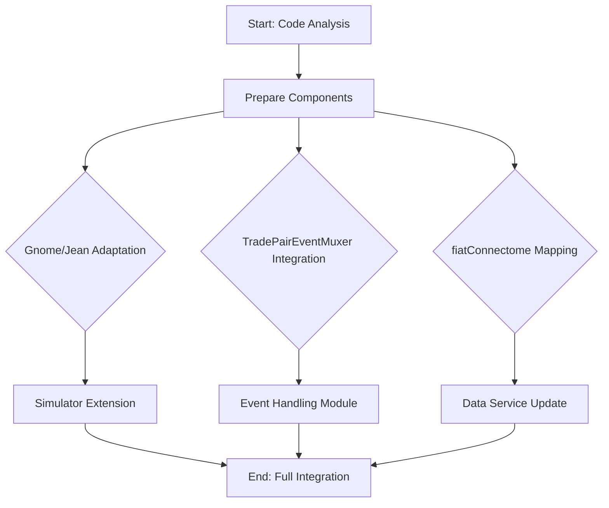

# Integration Plan for coinandparings into DSEL System

## Overview
This document outlines the refined plan for integrating the coinandparings codebase into the DSEL system within the moneyfan project. The integration focuses on leveraging specific components for simulation, agent functionality, and asset relationship management.

## Refined Integration Plan

1. **Simulator (Gnome/Jean Classes)**:
   - **Source**: [`Gnome.kt`](../mp-superproject/bfneat/src/main/java/pairwise/idiom/neat/Gnome.kt) and [`Jean.kt`](../mp-superproject/bfneat/src/main/java/pairwise/idiom/neat/Jean.kt) for genetic algorithm and neural network components.
   - **Integration**: Extend the existing [`Simulator.java`](src/main/java/com/moneyfan/simulator/Simulator.java) class in `com.moneyfan.simulator` to incorporate Gnome's evolutionary logic for generating and managing asset pairs. Ensure Jean's mutation and activation functions are adapted for compatibility with DSEL's `Cursor` Series data structures.
   - **Key Functionality**: Implement methods for evolving trading strategies, handling asset pairing, and simulating trades using DSEL's Series models.

2. **Agent Client (TradePairEventMuxer)**:
   - **Source**: [`TradePairEventMuxer.kt`](../mp-superproject/mp/acapulco.old/src/main/java/org/bereft/TradePairEventMuxer.kt) for event handling.
   - **Integration**: Develop a new class under `com.moneyfan.dsel`, such as `TradeEventMuxer`, to manage real-time events. Adapt it to interface with DSEL's asynchronous event pipeline and `Cursor` for data representation.
   - **Key Functionality**: Process intra-candle updates and notifications, ensuring seamless integration with DSEL's trading simulations.

3. **Connectome (fiatConnectome)**:
   - **Source**: [`CoinsAndPairings.kt`](../mp-superproject/mp/acapulco.old/src/main/java/org/bereft/CoinsAndPairings.kt) for asset relationships.
   - **Integration**: Integrate `fiatConnectome` logic into `HistoricalDataService` or a new utility class in `com.moneyfan.model` to handle asset pairing and data fetching. Use it to enhance DSEL's querying capabilities with connectome-based relationships.
   - **Key Functionality**: Manage dynamic asset connections for efficient data retrieval and trading strategies.

4. **Additional Refinements**:
   - **Testing and Verification**: Add steps for unit testing the integrated components to confirm completeness and functionality.
   - **Error Handling**: Incorporate checks for potential issues like data mismatches or incompatibilities.

## Workflow Diagram

## Next Steps
- Begin implementation by adapting the identified components into the DSEL framework.
- Conduct iterative testing to ensure compatibility and performance.
- Document any challenges or deviations from this plan during the integration process.